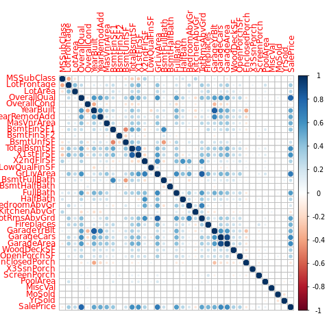

```R
train <- read.csv("train0.csv")
test <- read.csv("test.csv")

all_data <- rbind(train[,2:80],test[,2:80])

names(all_data)
```


     [1] "MSSubClass"    "MSZoning"      "LotFrontage"   "LotArea"      
     [5] "Street"        "Alley"         "LotShape"      "LandContour"  
     [9] "Utilities"     "LotConfig"     "LandSlope"     "Neighborhood" 
    [13] "Condition1"    "Condition2"    "BldgType"      "HouseStyle"   
    [17] "OverallQual"   "OverallCond"   "YearBuilt"     "YearRemodAdd" 
    [21] "RoofStyle"     "RoofMatl"      "Exterior1st"   "Exterior2nd"  
    [25] "MasVnrType"    "MasVnrArea"    "ExterQual"     "ExterCond"    
    [29] "Foundation"    "BsmtQual"      "BsmtCond"      "BsmtExposure" 
    [33] "BsmtFinType1"  "BsmtFinSF1"    "BsmtFinType2"  "BsmtFinSF2"   
    [37] "BsmtUnfSF"     "TotalBsmtSF"   "Heating"       "HeatingQC"    
    [41] "CentralAir"    "Electrical"    "X1stFlrSF"     "X2ndFlrSF"    
    [45] "LowQualFinSF"  "GrLivArea"     "BsmtFullBath"  "BsmtHalfBath" 
    [49] "FullBath"      "HalfBath"      "BedroomAbvGr"  "KitchenAbvGr" 
    [53] "KitchenQual"   "TotRmsAbvGrd"  "Functional"    "Fireplaces"   
    [57] "FireplaceQu"   "GarageType"    "GarageYrBlt"   "GarageFinish" 
    [61] "GarageCars"    "GarageArea"    "GarageQual"    "GarageCond"   
    [65] "PavedDrive"    "WoodDeckSF"    "OpenPorchSF"   "EnclosedPorch"
    [69] "X3SsnPorch"    "ScreenPorch"   "PoolArea"      "PoolQC"       
    [73] "Fence"         "MiscFeature"   "MiscVal"       "MoSold"       
    [77] "YrSold"        "SaleType"      "SaleCondition"


```R
library(corrplot)
train_continuous <- c("MSSubClass","LotFrontage","LotArea","OverallQual",
                      "OverallCond","YearBuilt","YearRemodAdd","MasVnrArea",
                      "BsmtFinSF1","BsmtFinSF2","BsmtUnfSF","TotalBsmtSF",
                      "X1stFlrSF","X2ndFlrSF","LowQualFinSF","GrLivArea",
                      "BsmtFullBath","BsmtHalfBath","FullBath","HalfBath",
                      "BedroomAbvGr","KitchenAbvGr","TotRmsAbvGrd","Fireplaces",
                      "GarageYrBlt","GarageCars","GarageArea","WoodDeckSF",
                      "OpenPorchSF","EnclosedPorch","X3SsnPorch","ScreenPorch",
                      "PoolArea","MiscVal","MoSold","YrSold","SalePrice")

corrplot::corrplot(cor(train[,train_continuous[1:37]],use="pairwise.complete.obs"))

```





```R
naCol <- function(train){
  return(colnames(train)[colSums(is.na(train)) > 0])
}
train_NA <- naCol(all_data)
train_NA
summary(all_data[,train_NA[1:34]])
```


     [1] "MSZoning"     "LotFrontage"  "Alley"        "Utilities"    "Exterior1st" 
     [6] "Exterior2nd"  "MasVnrType"   "MasVnrArea"   "BsmtQual"     "BsmtCond"    
    [11] "BsmtExposure" "BsmtFinType1" "BsmtFinSF1"   "BsmtFinType2" "BsmtFinSF2"  
    [16] "BsmtUnfSF"    "TotalBsmtSF"  "Electrical"   "BsmtFullBath" "BsmtHalfBath"
    [21] "KitchenQual"  "Functional"   "FireplaceQu"  "GarageType"   "GarageYrBlt" 
    [26] "GarageFinish" "GarageCars"   "GarageArea"   "GarageQual"   "GarageCond"  
    [31] "PoolQC"       "Fence"        "MiscFeature"  "SaleType"    


        MSZoning     LotFrontage      Alley       Utilities     Exterior1st  
     C (all):  25   Min.   : 21.00   Grvl: 120   AllPub:2916   VinylSd:1025  
     FV     : 139   1st Qu.: 59.00   Pave:  78   NoSeWa:   1   MetalSd: 450  
     RH     :  26   Median : 68.00   NA's:2721   NA's  :   2   HdBoard: 442  
     RL     :2265   Mean   : 69.31                             Wd Sdng: 411  
     RM     : 460   3rd Qu.: 80.00                             Plywood: 221  
     NA's   :   4   Max.   :313.00                             (Other): 369  
                    NA's   :486                                NA's   :   1  
      Exterior2nd     MasVnrType     MasVnrArea     BsmtQual    BsmtCond   
     VinylSd:1014   BrkCmn :  25   Min.   :   0.0   Ex  : 258   Fa  : 104  
     MetalSd: 447   BrkFace: 879   1st Qu.:   0.0   Fa  :  88   Gd  : 122  
     HdBoard: 406   None   :1742   Median :   0.0   Gd  :1209   Po  :   5  
     Wd Sdng: 391   Stone  : 249   Mean   : 102.2   TA  :1283   TA  :2606  
     Plywood: 270   NA's   :  24   3rd Qu.: 164.0   NA's:  81   NA's:  82  
     (Other): 390                  Max.   :1600.0                          
     NA's   :   1                  NA's   :23                              
     BsmtExposure BsmtFinType1   BsmtFinSF1     BsmtFinType2   BsmtFinSF2     
     Av  : 418    ALQ :429     Min.   :   0.0   ALQ :  52    Min.   :   0.00  
     Gd  : 276    BLQ :269     1st Qu.:   0.0   BLQ :  68    1st Qu.:   0.00  
     Mn  : 239    GLQ :849     Median : 368.5   GLQ :  34    Median :   0.00  
     No  :1904    LwQ :154     Mean   : 441.4   LwQ :  87    Mean   :  49.58  
     NA's:  82    Rec :288     3rd Qu.: 733.0   Rec : 105    3rd Qu.:   0.00  
                  Unf :851     Max.   :5644.0   Unf :2493    Max.   :1526.00  
                  NA's: 79     NA's   :1        NA's:  80    NA's   :1        
       BsmtUnfSF       TotalBsmtSF     Electrical    BsmtFullBath   
     Min.   :   0.0   Min.   :   0.0   FuseA: 188   Min.   :0.0000  
     1st Qu.: 220.0   1st Qu.: 793.0   FuseF:  50   1st Qu.:0.0000  
     Median : 467.0   Median : 989.5   FuseP:   8   Median :0.0000  
     Mean   : 560.8   Mean   :1051.8   Mix  :   1   Mean   :0.4299  
     3rd Qu.: 805.5   3rd Qu.:1302.0   SBrkr:2671   3rd Qu.:1.0000  
     Max.   :2336.0   Max.   :6110.0   NA's :   1   Max.   :3.0000  
     NA's   :1        NA's   :1                     NA's   :2       
      BsmtHalfBath     KitchenQual   Functional   FireplaceQu   GarageType  
     Min.   :0.00000   Ex  : 205   Typ    :2717   Ex  :  43   2Types :  23  
     1st Qu.:0.00000   Fa  :  70   Min2   :  70   Fa  :  74   Attchd :1723  
     Median :0.00000   Gd  :1151   Min1   :  65   Gd  : 744   Basment:  36  
     Mean   :0.06136   TA  :1492   Mod    :  35   Po  :  46   BuiltIn: 186  
     3rd Qu.:0.00000   NA's:   1   Maj1   :  19   TA  : 592   CarPort:  15  
     Max.   :2.00000               (Other):  11   NA's:1420   Detchd : 779  
     NA's   :2                     NA's   :   2               NA's   : 157  
      GarageYrBlt   GarageFinish   GarageCars      GarageArea     GarageQual 
     Min.   :1895   Fin : 719    Min.   :0.000   Min.   :   0.0   Ex  :   3  
     1st Qu.:1960   RFn : 811    1st Qu.:1.000   1st Qu.: 320.0   Fa  : 124  
     Median :1979   Unf :1230    Median :2.000   Median : 480.0   Gd  :  24  
     Mean   :1978   NA's: 159    Mean   :1.767   Mean   : 472.9   Po  :   5  
     3rd Qu.:2002                3rd Qu.:2.000   3rd Qu.: 576.0   TA  :2604  
     Max.   :2207                Max.   :5.000   Max.   :1488.0   NA's: 159  
     NA's   :159                 NA's   :1       NA's   :1                   
     GarageCond   PoolQC       Fence      MiscFeature    SaleType   
     Ex  :   3   Ex  :   4   GdPrv: 118   Gar2:   5   WD     :2525  
     Fa  :  74   Fa  :   2   GdWo : 112   Othr:   4   New    : 239  
     Gd  :  15   Gd  :   4   MnPrv: 329   Shed:  95   COD    :  87  
     Po  :  14   NA's:2909   MnWw :  12   TenC:   1   ConLD  :  26  
     TA  :2654               NA's :2348   NA's:2814   CWD    :  12  
     NA's: 159                                        (Other):  29  
                                                      NA's   :   1  


```R
# 1st NA : LotFrontage
summary(lm(LotFrontage ~ LotArea+X1stFlrSF+TotRmsAbvGrd+GarageArea+SalePrice,data = train))

model_NA1 <- lm(LotFrontage ~ LotArea+X1stFlrSF+TotRmsAbvGrd+GarageArea+SalePrice,data = train)
t <- all_data
t$LotFrontage <-NULL
x <- predict(model_NA1,t)
t$LotFrontage <- ifelse(is.na(all_data$LotFrontage),x,all_data$LotFrontage)
all_data <- t
```


    
    Call:
    lm(formula = LotFrontage ~ LotArea + X1stFlrSF + TotRmsAbvGrd + 
        GarageArea + SalePrice, data = train)
    
    Residuals:
         Min       1Q   Median       3Q      Max 
    -116.659  -10.025   -0.251    9.133  206.691 
    
    Coefficients:
                   Estimate Std. Error t value Pr(>|t|)    
    (Intercept)   2.273e+01  2.604e+00   8.729  < 2e-16 ***
    LotArea       8.866e-04  7.846e-05  11.301  < 2e-16 ***
    X1stFlrSF     1.702e-02  1.995e-03   8.529  < 2e-16 ***
    TotRmsAbvGrd  2.439e+00  4.251e-01   5.739 1.21e-08 ***
    GarageArea    1.491e-02  3.438e-03   4.338 1.56e-05 ***
    SalePrice    -2.327e-05  1.072e-05  -2.170   0.0302 *  
    ---
    Signif. codes:  0 ‘***’ 0.001 ‘**’ 0.01 ‘*’ 0.05 ‘.’ 0.1 ‘ ’ 1
    
    Residual standard error: 20.02 on 1195 degrees of freedom
      (259 observations deleted due to missingness)
    Multiple R-squared:  0.3234,	Adjusted R-squared:  0.3206 
    F-statistic: 114.2 on 5 and 1195 DF,  p-value: < 2.2e-16


    Error in eval(expr, envir, enclos): object 'SalePrice' not found


```R
# 2nd NA : MasVnrArea

summary(lm(MasVnrArea~YearBuilt+TotalBsmtSF+GrLivArea+GarageArea+SalePrice,data = train)) 

model_NA2 <- lm(MasVnrArea~YearBuilt+TotalBsmtSF+GrLivArea+GarageArea+SalePrice,data = train)
t <- all_data
t$MasVnrArea <-NULL
x <- predict(model_NA2,t)
t$MasVnrArea <- ifelse(is.na(all_data$MasVnrArea),x,all_data$MasVnrArea)
all_data <- t
```


    
    Call:
    lm(formula = MasVnrArea ~ YearBuilt + TotalBsmtSF + GrLivArea + 
        GarageArea + SalePrice, data = train)
    
    Residuals:
        Min      1Q  Median      3Q     Max 
    -621.16  -88.74  -28.73   45.23 1426.68 
    
    Coefficients:
                  Estimate Std. Error t value Pr(>|t|)    
    (Intercept) -1.271e+03  3.363e+02  -3.778 0.000164 ***
    YearBuilt    5.790e-01  1.731e-01   3.344 0.000847 ***
    TotalBsmtSF  3.547e-02  1.211e-02   2.930 0.003444 ** 
    GrLivArea    4.491e-02  1.171e-02   3.836 0.000131 ***
    GarageArea   6.698e-02  2.569e-02   2.607 0.009215 ** 
    SalePrice    5.310e-04  9.704e-05   5.472 5.23e-08 ***
    ---
    Signif. codes:  0 ‘***’ 0.001 ‘**’ 0.01 ‘*’ 0.05 ‘.’ 0.1 ‘ ’ 1
    
    Residual standard error: 156.7 on 1446 degrees of freedom
      (8 observations deleted due to missingness)
    Multiple R-squared:  0.2532,	Adjusted R-squared:  0.2507 
    F-statistic: 98.08 on 5 and 1446 DF,  p-value: < 2.2e-16


    Error in eval(expr, envir, enclos): object 'SalePrice' not found


```R
# 3rd NA : GarageYrBlt
summary(lm(GarageYrBlt~OverallCond+YearBuilt+YearRemodAdd+FullBath+GarageArea+SalePrice,data = train))

model_NA3 <- lm(GarageYrBlt~OverallCond+YearBuilt+YearRemodAdd+FullBath+GarageArea+SalePrice,data = train)
t <- all_data
t$GarageYrBlt <-NULL
x <- predict(model_NA3,t)
t$GarageYrBlt <- ifelse(is.na(all_data$GarageYrBlt),x,all_data$GarageYrBlt)
all_data <- t
```


    
    Call:
    lm(formula = GarageYrBlt ~ OverallCond + YearBuilt + YearRemodAdd + 
        FullBath + GarageArea + SalePrice, data = train)
    
    Residuals:
        Min      1Q  Median      3Q     Max 
    -52.607  -5.638  -0.267   4.249  58.498 
    
    Coefficients:
                   Estimate Std. Error t value Pr(>|t|)    
    (Intercept)   4.710e+02  3.903e+01  12.070  < 2e-16 ***
    OverallCond  -1.018e+00  3.719e-01  -2.737  0.00629 ** 
    YearBuilt     5.002e-01  1.778e-02  28.132  < 2e-16 ***
    YearRemodAdd  2.581e-01  2.355e-02  10.957  < 2e-16 ***
    FullBath      2.007e+00  7.670e-01   2.616  0.00899 ** 
    GarageArea    3.414e-02  2.298e-03  14.858  < 2e-16 ***
    SalePrice    -3.405e-05  6.064e-06  -5.615 2.37e-08 ***
    ---
    Signif. codes:  0 ‘***’ 0.001 ‘**’ 0.01 ‘*’ 0.05 ‘.’ 0.1 ‘ ’ 1
    
    Residual standard error: 12.21 on 1372 degrees of freedom
      (81 observations deleted due to missingness)
    Multiple R-squared:  0.7567,	Adjusted R-squared:  0.7556 
    F-statistic:   711 on 6 and 1372 DF,  p-value: < 2.2e-16


    Error in eval(expr, envir, enclos): object 'SalePrice' not found


```R
summary(all_data[,train_NA[1:34]])
```


        MSZoning     LotFrontage      Alley       Utilities     Exterior1st  
     C (all):  25   Min.   : 21.00   Grvl: 120   AllPub:2916   VinylSd:1025  
     FV     : 139   1st Qu.: 60.00   Pave:  78   NoSeWa:   1   MetalSd: 450  
     RH     :  26   Median : 68.55   NA's:2721   NA's  :   2   HdBoard: 442  
     RL     :2265   Mean   : 69.80                             Wd Sdng: 411  
     RM     : 460   3rd Qu.: 80.00                             Plywood: 221  
     NA's   :   4   Max.   :313.00                             (Other): 369  
                                                               NA's   :   1  
      Exterior2nd     MasVnrType     MasVnrArea     BsmtQual    BsmtCond   
     VinylSd:1014   BrkCmn :  25   Min.   :   0.0   Ex  : 258   Fa  : 104  
     MetalSd: 447   BrkFace: 879   1st Qu.:   0.0   Fa  :  88   Gd  : 122  
     HdBoard: 406   None   :1742   Median :   0.0   Gd  :1209   Po  :   5  
     Wd Sdng: 391   Stone  : 249   Mean   : 102.0   TA  :1283   TA  :2606  
     Plywood: 270   NA's   :  24   3rd Qu.: 163.5   NA's:  81   NA's:  82  
     (Other): 390                  Max.   :1600.0                          
     NA's   :   1                                                          
     BsmtExposure BsmtFinType1   BsmtFinSF1     BsmtFinType2   BsmtFinSF2     
     Av  : 418    ALQ :429     Min.   :   0.0   ALQ :  52    Min.   :   0.00  
     Gd  : 276    BLQ :269     1st Qu.:   0.0   BLQ :  68    1st Qu.:   0.00  
     Mn  : 239    GLQ :849     Median : 368.5   GLQ :  34    Median :   0.00  
     No  :1904    LwQ :154     Mean   : 441.4   LwQ :  87    Mean   :  49.58  
     NA's:  82    Rec :288     3rd Qu.: 733.0   Rec : 105    3rd Qu.:   0.00  
                  Unf :851     Max.   :5644.0   Unf :2493    Max.   :1526.00  
                  NA's: 79     NA's   :1        NA's:  80    NA's   :1        
       BsmtUnfSF       TotalBsmtSF     Electrical    BsmtFullBath   
     Min.   :   0.0   Min.   :   0.0   FuseA: 188   Min.   :0.0000  
     1st Qu.: 220.0   1st Qu.: 793.0   FuseF:  50   1st Qu.:0.0000  
     Median : 467.0   Median : 989.5   FuseP:   8   Median :0.0000  
     Mean   : 560.8   Mean   :1051.8   Mix  :   1   Mean   :0.4299  
     3rd Qu.: 805.5   3rd Qu.:1302.0   SBrkr:2671   3rd Qu.:1.0000  
     Max.   :2336.0   Max.   :6110.0   NA's :   1   Max.   :3.0000  
     NA's   :1        NA's   :1                     NA's   :2       
      BsmtHalfBath     KitchenQual   Functional   FireplaceQu   GarageType  
     Min.   :0.00000   Ex  : 205   Typ    :2717   Ex  :  43   2Types :  23  
     1st Qu.:0.00000   Fa  :  70   Min2   :  70   Fa  :  74   Attchd :1723  
     Median :0.00000   Gd  :1151   Min1   :  65   Gd  : 744   Basment:  36  
     Mean   :0.06136   TA  :1492   Mod    :  35   Po  :  46   BuiltIn: 186  
     3rd Qu.:0.00000   NA's:   1   Maj1   :  19   TA  : 592   CarPort:  15  
     Max.   :2.00000               (Other):  11   NA's:1420   Detchd : 779  
     NA's   :2                     NA's   :   2               NA's   : 157  
      GarageYrBlt      GarageFinish   GarageCars      GarageArea     GarageQual 
     Min.   :  36.81   Fin : 719    Min.   :0.000   Min.   :   0.0   Ex  :   3  
     1st Qu.:1957.00   RFn : 811    1st Qu.:1.000   1st Qu.: 320.0   Fa  : 124  
     Median :1977.00   Unf :1230    Median :2.000   Median : 480.0   Gd  :  24  
     Mean   :1873.81   NA's: 159    Mean   :1.767   Mean   : 472.9   Po  :   5  
     3rd Qu.:2001.00                3rd Qu.:2.000   3rd Qu.: 576.0   TA  :2604  
     Max.   :2207.00                Max.   :5.000   Max.   :1488.0   NA's: 159  
                                    NA's   :1       NA's   :1                   
     GarageCond   PoolQC       Fence      MiscFeature    SaleType   
     Ex  :   3   Ex  :   4   GdPrv: 118   Gar2:   5   WD     :2525  
     Fa  :  74   Fa  :   2   GdWo : 112   Othr:   4   New    : 239  
     Gd  :  15   Gd  :   4   MnPrv: 329   Shed:  95   COD    :  87  
     Po  :  14   NA's:2909   MnWw :  12   TenC:   1   ConLD  :  26  
     TA  :2654               NA's :2348   NA's:2814   CWD    :  12  
     NA's: 159                                        (Other):  29  
                                                      NA's   :   1  


```R
train_NA
```


     [1] "MSZoning"     "LotFrontage"  "Alley"        "Utilities"    "Exterior1st" 
     [6] "Exterior2nd"  "MasVnrType"   "MasVnrArea"   "BsmtQual"     "BsmtCond"    
    [11] "BsmtExposure" "BsmtFinType1" "BsmtFinSF1"   "BsmtFinType2" "BsmtFinSF2"  
    [16] "BsmtUnfSF"    "TotalBsmtSF"  "Electrical"   "BsmtFullBath" "BsmtHalfBath"
    [21] "KitchenQual"  "Functional"   "FireplaceQu"  "GarageType"   "GarageYrBlt" 
    [26] "GarageFinish" "GarageCars"   "GarageArea"   "GarageQual"   "GarageCond"  
    [31] "PoolQC"       "Fence"        "MiscFeature"  "SaleType"    


